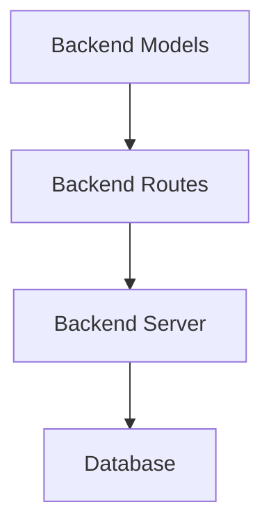
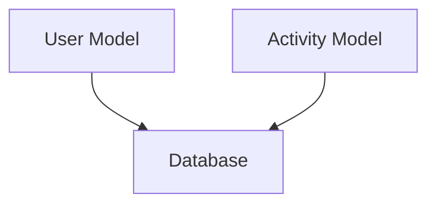

# Architecture Overview
The architecture of this application follows the Model-View-Controller (MVC) pattern, which separates the application logic into three interconnected components. This separation allows for a more maintainable, flexible, and scalable application.

## High-Level Architecture
```mermaid
graph TD
    Frontend[React Frontend]
    -->|API Calls|> Backend[Express API]
    Backend
    -->|Database Interactions|> Database[(MongoDB)]
    Mobile[Mobile App]
    -->|API Calls|> Backend
```

## Backend Architecture
The backend is built using Express.js and follows the MVC pattern. It consists of the following components:
- **Models**: Define the structure of the data stored in the database. In this application, we have `User` and `Activity` models.
- **Routes**: Handle incoming HTTP requests and send responses. For example, `userRoutes.js`, `activityRoutes.js`, `summarizeRoutes.js`, and `leaderboardRoutes.js`.
- **Server**: The main entry point of the application, responsible for setting up the server and handling API calls.



## Frontend and Mobile Architecture
Both the frontend (React) and mobile app make API calls to the backend to interact with the application's data. The frontend uses API calls to interact with user and activity data, while the mobile app also makes API calls to retrieve activity data.

```mermaid
graph TD
    Frontend[React Frontend]
    -->|API Call|> Backend
    Mobile[Mobile App]
    -->|API Call|> Backend
```

## API Calls
The application makes the following API calls:
- **User Routes**:
  - `POST /register`
  - `POST /login`
  - `POST /complete-level`
- **Activity Routes**:
  - `POST /`
  - `GET /today/:name`
  - `POST /user`
- **Summarize Routes**:
  - `POST /`
  - `POST /ask-eco`
- **Leaderboard Route**:
  - `GET /`

```mermaid
graph TD
    UserRoutes[User Routes]
    -->|Register|> Backend
    UserRoutes
    -->|Login|> Backend
    UserRoutes
    -->|Complete Level|> Backend
    ActivityRoutes[Activity Routes]
    -->|Create Activity|> Backend
    ActivityRoutes
    -->|Get Today's Activity|> Backend
    ActivityRoutes
    -->|Create User Activity|> Backend
    SummarizeRoutes[Summarize Routes]
    -->|Summarize|> Backend
    SummarizeRoutes
    -->|Ask Eco|> Backend
    LeaderboardRoute[Leaderboard Route]
    -->|Get Leaderboard|> Backend
```

## Database Models
The application uses the following database models:
- **User**: Represents a user in the application.
- **Activity**: Represents an activity in the application.

