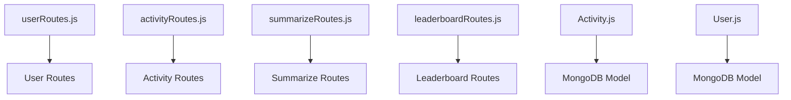
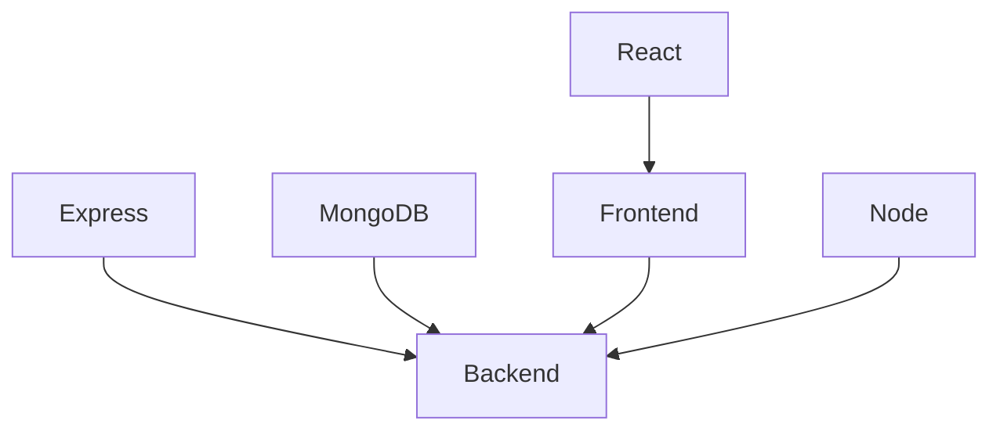

# Architecture Overview
The architecture of this project is based on the Model-View-Controller (MVC) pattern, using the MERN (MongoDB, Express, React, Node) stack. The project is divided into two main parts: the backend and the frontend. The backend is built using Node and Express, while the frontend is built using React.

## Overall System Architecture
```mermaid
graph TD
    A[Frontend] -->|API Calls|> B[Backend]
    B -->|Database Queries|> C[MongoDB]
    C -->|Data|> B
    B -->|Data|> A
```

# Folder Structure
The folder structure of the project is as follows:
- `components`: contains reusable React components
- `pages`: contains React pages
- `utils`: contains utility functions
- `models`: contains MongoDB models
- `routes`: contains Express routes
- `server.js`: contains the Express server setup

## Folder Structure Diagram
```mermaid
graph TD
    A[Root] --> B[components]
    A --> C(pages]
    A --> D[utils]
    A --> E[models]
    A --> F[routes]
    A --> G[server.js]
```

# Request Lifecycle
The request lifecycle of the project is as follows:
1. The user makes a request to the frontend.
2. The frontend makes an API call to the backend.
3. The backend receives the API call and processes it.
4. The backend makes a database query to MongoDB if necessary.
5. The backend sends a response back to the frontend.
6. The frontend receives the response and updates the user interface.

## Request Lifecycle Diagram
```mermaid
graph TD
    A[User] -->|Request|> B[Frontend]
    B -->|API Call|> C[Backend]
    C -->|Database Query|> D[MongoDB]
    D -->|Data|> C
    C -->|Response|> B
    B -->|Update UI|> A
```

# Key Modules
The key modules of the project are:
- `userRoutes.js`: contains Express routes for user-related functionality
- `activityRoutes.js`: contains Express routes for activity-related functionality
- `summarizeRoutes.js`: contains Express routes for summarize-related functionality
- `leaderboardRoutes.js`: contains Express routes for leaderboard-related functionality
- `Activity.js`: contains the MongoDB model for activities
- `User.js`: contains the MongoDB model for users

## Key Modules Diagram


# Dependencies
The dependencies of the project are:
- `express`: for building the Express server
- `mongodb`: for interacting with the MongoDB database
- `react`: for building the frontend
- `node`: for running the backend

## Dependencies Diagram
