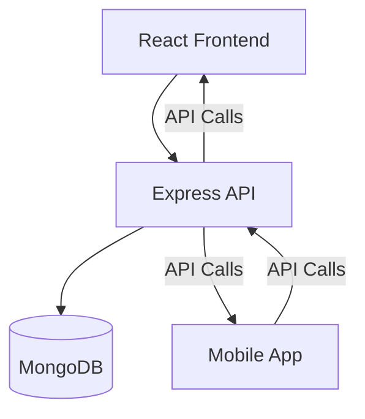
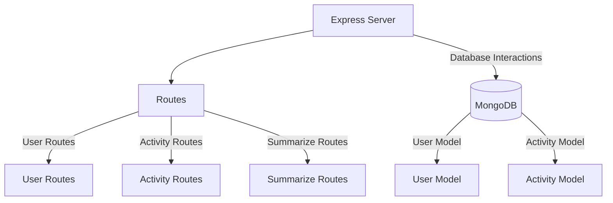
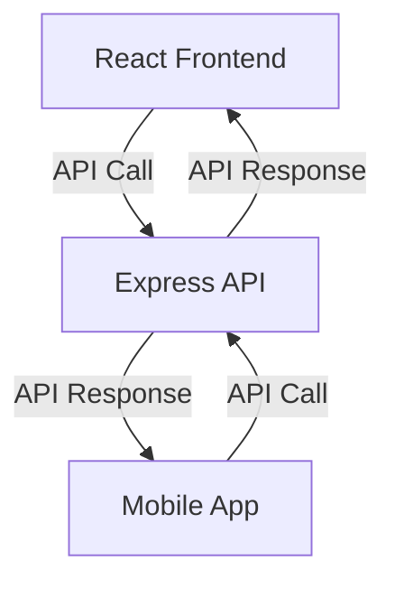

# Architecture
## Overview
The system architecture is based on the Model-View-Controller (MVC) pattern, using a MERN (MongoDB, Express, React, Node) stack. The backend is built using Express, with routes defined in separate files for different functionalities. The frontend is built using React, with API calls made to the backend for data retrieval and manipulation.

## System Components
The system consists of the following components:
* Frontend: Built using React, responsible for rendering the user interface and handling user interactions.
* Backend: Built using Express, responsible for handling API requests, interacting with the database, and providing data to the frontend.
* Database: Built using MongoDB, responsible for storing and retrieving data.

## System Architecture Diagram

## Backend Architecture
The backend architecture consists of the following components:
* Routes: Defined in separate files for different functionalities, such as user routes, activity routes, and summarize routes.
* Models: Defined in separate files for different database models, such as user and activity models.
* Server: Responsible for handling API requests and interacting with the database.

## Backend Architecture Diagram

## API Calls
The frontend and mobile app make API calls to the backend to retrieve and manipulate data. The API calls are made to the following endpoints:
* `https://b09-backend.onrender.com/api/users/complete-level`
* `https://b09-backend.onrender.com/api/activities`
* `https://b09-backend.onrender.com/api/activities` (mobile app)

## API Call Diagram
