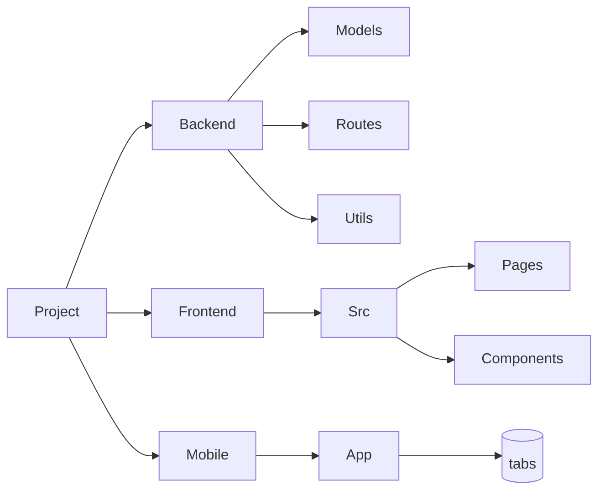
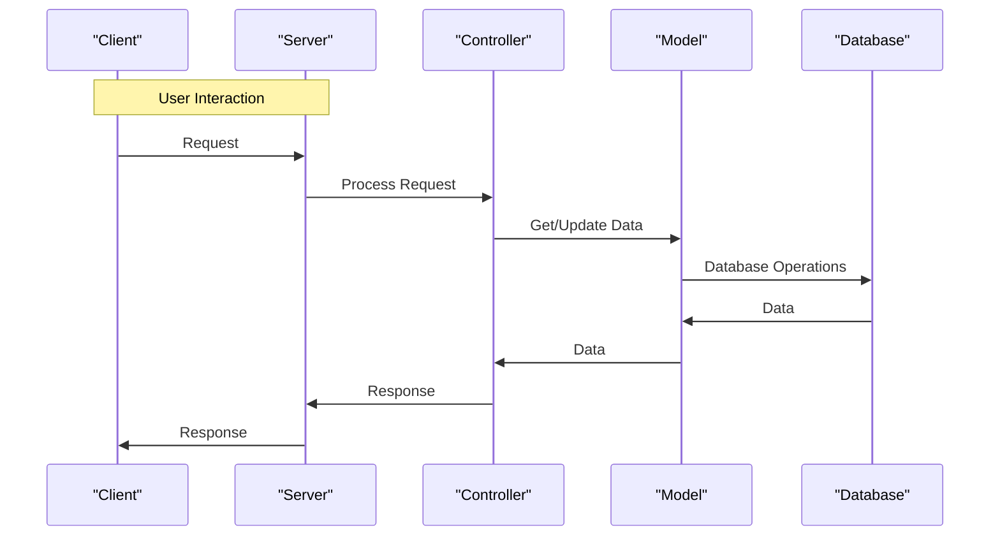
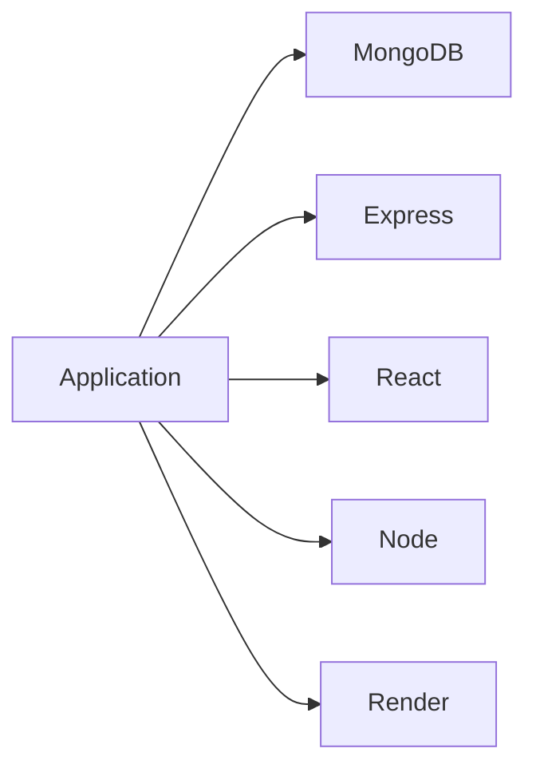

# Architecture Overview
The proposed MERN (MongoDB, Express, React, Node) application follows the Model-View-Controller (MVC) architecture pattern. This allows for a clear separation of concerns between the application's logic, data storage, and user interface.

## Folder Structure
The project is organized into the following key directories:
```markdown
- backend
  - models
  - routes
  - utils
- frontend
  - src
    - pages
    - components
- mobile
  - app
    - (tabs)
```
Below is a high-level representation of the folder structure using Mermaid:


## Request Lifecycle
When a user interacts with the application, the following events occur:
1. The user's request is sent to the server.
2. The server processes the request using the relevant route and controller.
3. The controller interacts with the model to retrieve or update data.
4. The model performs the necessary database operations.
5. The controller processes the data and sends a response back to the client.

Below is a representation of the request lifecycle using Mermaid:


## Key Modules
The following modules are crucial to the application's functionality:
- **User Routes**: Handles user registration, login, and level completion.
- **Activity Routes**: Handles activity-related operations, such as creating, reading, and updating activities.
- **Summarize Routes**: Handles summarization-related operations, such as asking eco-related questions.
- **Leaderboard Routes**: Handles leaderboard-related operations, such as retrieving the leaderboard.
- **User Model**: Represents a user in the database.
- **Activity Model**: Represents an activity in the database.

## Dependencies
The application relies on the following dependencies:
- **MongoDB**: The NoSQL database used for data storage.
- **Express**: The Node.js framework used for building the server.
- **React**: The JavaScript library used for building the frontend.
- **Node**: The JavaScript runtime environment used for building the server.
- **Render**: The platform used for deploying the application.

Below is a representation of the dependencies using Mermaid:
